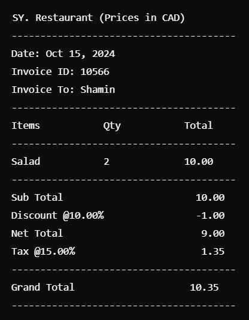

# Quick Invoice

Quick Invoice is a simple command-line based restaurant billing system written in C. This project allows users to generate invoices for a restaurant, including details such as customer name, items, quantities, prices, discounts, and taxes. It generates invoices in a `.txt` format for easy viewing and storage.

## Features

- Generate invoices with customer details, item quantities, prices, discounts, and taxes.
- Save invoices to `.txt` files for future reference.
- Load and view existing invoices.
- Search for invoices by customer name (case-insensitive).
- Display all prices in CAD (Canadian Dollars).

## How It Works

1. **Generate Invoice**: Enter customer name, item details (name, quantity, price), discount rate, and tax rate. The program will display the invoice on the screen and save it as a `.txt` file in the format `Invoice_<ID>.txt`.
2. **Load Invoice**: Enter the invoice ID to load and view a previously saved invoice.
3. **Search Invoice by Customer**: Enter the customer's name to search for invoices. The search is case-insensitive.
4. **Exit**: Close the program.

## Example Output

Here's an example of the invoice format generated by the program:

## Project Structure

- `quick_invoice_generator.c` - The main source code file containing the program logic.
- `sample_output.png` - Image showing the example output.

## Future Enhancements

- Implement a graphical user interface (GUI) using a framework like GTK.
- Support exporting invoices to different formats, such as PDF or CSV.
- Add multi-user support with authentication for accessing the system.
- Generate summary reports for sales on a weekly or monthly basis.

 ## 📧 Contact

Feel free to reach out if you have questions or would like to follow the development of **Quick Invoice**:

- **👤 Name**: Shamin Yasar
- **📧 Email**: shaminyasar2001@gmail.com
- **🌐 Portfolio**: [here](https://shamin-portfolio.netlify.app/) 
